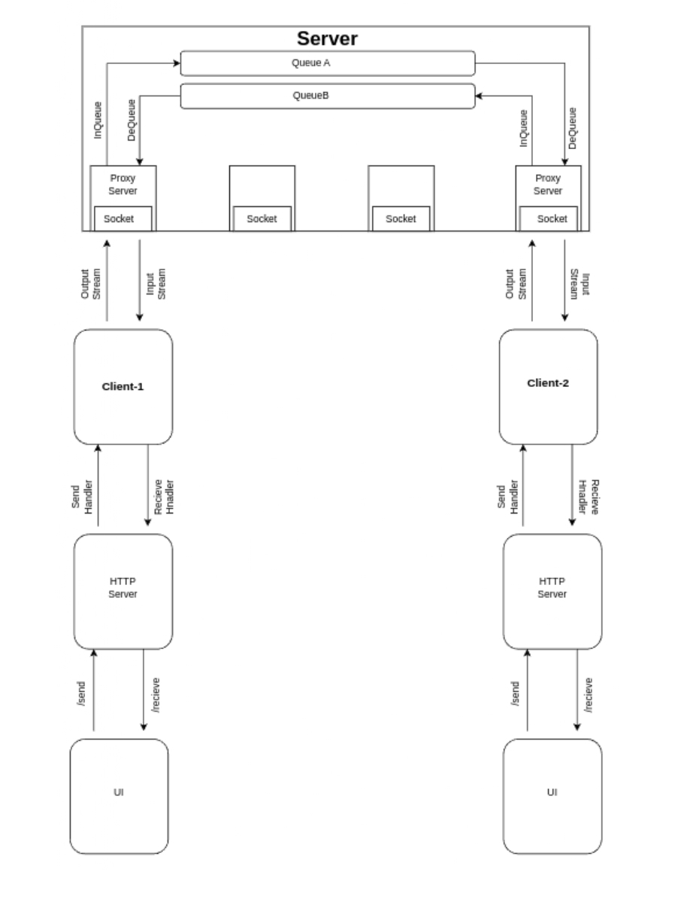

# A Socket-Based Communication System

A **socket-based communication system** implemented in **Java** with a **web UI** for real-time communication.

---

## 🚀 Features
- **Real-time communication**
- **Dual chat windows** (User-1 and User-2)
- **Web UI**

---

## 📷 HLD (High-Level Diagram)



## Components:

### 1. **Client Side**
Each client consists of the following modules:

- **UI (User Interface):**  
  The front-end layer responsible for capturing user input and displaying received messages in real time.

- **HTTP Server:**  
  Acts as a bridge between the UI and client logic. It handles incoming messages from the UI and sends data back after processing.

- **Client (Core Logic):**  
  Manages communication with the server using sockets. It includes:
  - **Send Handler:** Sends user messages to the server.
  - **Receive Handler:** Listens for and processes server responses.

### 2. **Server Side**
The server is responsible for handling incoming socket connections and routing messages between clients. It consists of:

- **Proxy Servers:**  
  Intermediaries that maintain socket connections with clients. Each client connects to a dedicated proxy server.

- **Queues (QueueA & QueueB):**  
  - **QueueA:** Handles messages from Client-1.
  - **QueueB:** Handles messages from Client-2.  
  These queues help manage asynchronous message flow between clients.

- **Sockets:**  
  Facilitate data exchange between the server and clients using input and output streams.

---

## 🛠 Tech Stack

### Frontend
- HTML  
- CSS  
- **JavaScript**

### Backend
- **Java**  
- **Sockets**  
- **HTTP Sockets**

## Setup and Run

1. Pull repo to local (https://github.com/Parbhat-Bansal/webChat_App)

2. **Compile and Run the Server and Clients:**

   To compile and run the server and clients, execute the following commands:

   ```bash
   # Compile and run the Server
   javac WebChat/Server.java 
   java WebChat.Server

   # Compile and run Client1
   javac WebChat/Client1.java 
   java WebChat.Client1

   # Compile and run Client2
   javac WebChat/Client2.java 
   java WebChat.Client2

3. Copy the path of index.html and paste in chrome.  


## 🎥 Demo Video

<video width="1000" controls>
  <source src="./assets/WebChat_Demo.mp4" type="video/mp4">
  Your browser does not support the video tag.
</video>


## 📄 Usage

After setting up and running the server and both clients:

- Each user can send and receive messages in **real-time** through their respective chat windows.
- **Client-1** and **Client-2** communicate via the central **server**, which routes messages between them.
- The server ensures **asynchronous communication**, meaning each client can send and receive messages independently without waiting for the other.
- The web UI updates instantly as new messages arrive, providing a seamless chat experience.
